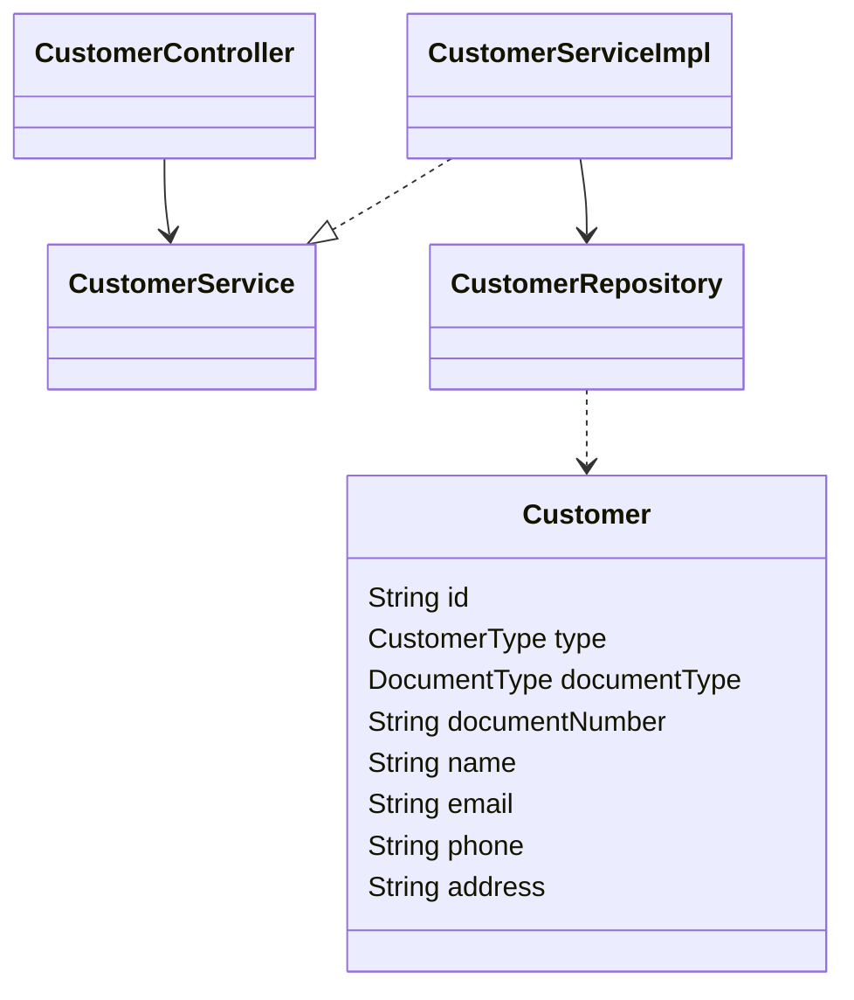
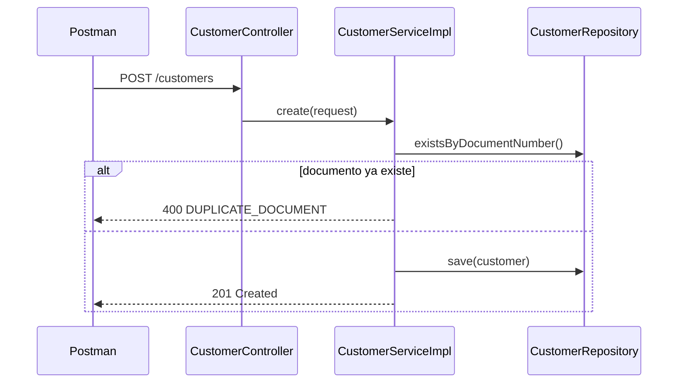

# Diagramas

## Clases

```mermaid
classDiagram
  CustomerController --> CustomerService
  CustomerServiceImpl ..|> CustomerService
  CustomerServiceImpl --> CustomerRepository
  CustomerRepository ..> Customer
  class Customer {
    String id
    CustomerType type
    DocumentType documentType
    String documentNumber
    String name
    String email
    String phone
    String address
  }
```

## Secuencia: crear cliente

```mermaid
sequenceDiagram
  Postman->>CustomerController: POST /customers
  CustomerController->>CustomerServiceImpl: create(request)
  CustomerServiceImpl->>CustomerRepository: existsByDocumentNumber()
  alt documento ya existe
    CustomerServiceImpl-->>Postman: 400 DUPLICATE_DOCUMENT
  else
    CustomerServiceImpl->>CustomerRepository: save(customer)
    CustomerServiceImpl-->>Postman: 201 Created
  end
```
